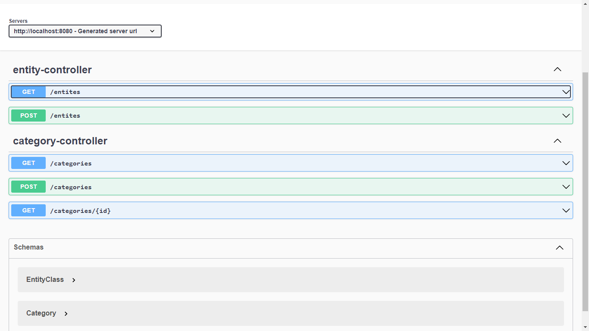
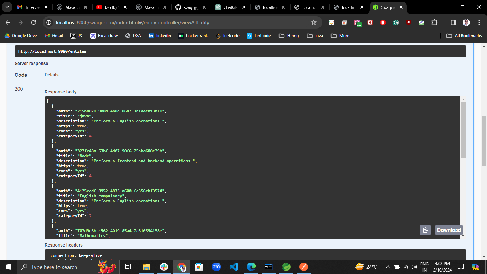
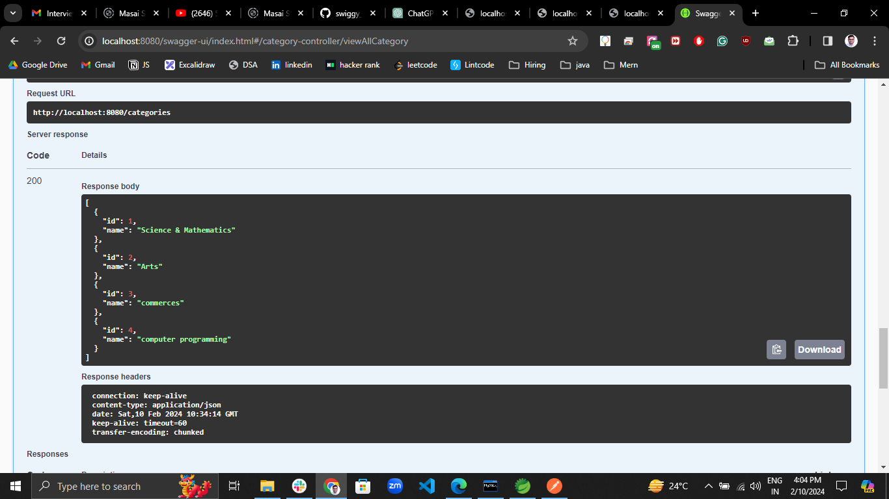
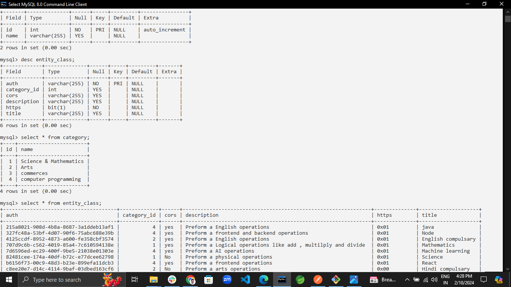

# prospecta_Assignment  
## Entity :  
1. Entity class  
    a. auth(primary key) 
    b. title  
    c. description  
    d. https  
    e. cors  
    f. categoryId  
    
2. Category 
    a. id(primary key)  
    b. name   

## service:  
1. EntityService :  
   methods :   
   a. postEntity   
   b. viewAllEntity   
   
2. CategoryService :   
    methods :   
     a. postCategory   
     b. postCategory   
     c. findById   

## controller :  
  1. EntityController   
     a.PutMapping for postEntity methods   
     b. GetMapping for viewAllEntity methods   
  3. CategoryController   
     a. PutMapping for postCategory methods   
     b. GetMapping for postCategory methods   
     c. GetMapping for viewById methods   
    
## swagger UI documentation :   

## All Entitys :  

 

## All category :   
 

 ## database Images :   
 
